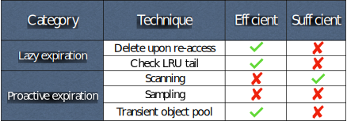

+++
title = 'Pelikan Segcache: a memory-efficient and scalable in-memory key-value cache for small objects'
date = 2021-10-01T20:00:00-04:00
author = 'Juncheng Yang'
draft = true
tags = ['caching', 'systems', 'performance', 'memory-management']
showToc = true
+++

In collaboration with Carnegie Mellon University, Twitter is building Pelikan's next generation of storage backend, which enables high memory efficiency, high throughput, and scalability for workloads that are primarily small objects and widely use TTL (time-to-live).

<!--more-->

In-memory key-value caches such as Memcached and Pelikan are widely deployed in modern web applications to provide low-latency, high-throughput services. In [previous posts](https://twitter.github.io/pelikan/blog/), we have described [caching at Twitter](https://twitter.github.io/pelikan/2020/benchmark-adq.html), [the design of Pelikan](https://twitter.github.io/pelikan/2019/why-pelikan.html), etc. This blog post will describe a new storage backend for Pelikan, called Segcache, developed in collaboration between [Carnegie Mellon University](http://www.cs.cmu.edu/~rvinayak/#group) and Twitter. The new design enables high memory efficiency, high throughput, and scalability for workloads that are mostly small objects and use TTL (time-to-live).[^1] As a spoiler, in our benchmark, Segcache can reduce the memory footprint of Twitter's largest cache cluster by up to 60% compared to the slab backend. 

[^1]: Workloads with large objects or do not use TTL can also benefit from Segcache, but the benefit is relatively smaller. 

## Background 

### Wide use of short TTLs
Time-to-live (TTL) is widely used in in-memory caches at Twitter and other friend companies for several reasons. When an object is written to the cache, a TTL is associated with the object. The following get requests do not update the TTL. When an object expires, it cannot be served to the user. 

First, TTL is used to bound staleness. Cache writes are best-effort; the data in the cache may be inconsistent with the data in the backend. To reduce the amount of stale data, TTLs are often used to ensure that stale data do not stay beyond too long in the cache. 
Second, TTL is used for periodical refreshes. For example, suppose a computation service (such as running machine learning predictions) wants to trigger the expensive computation every hour.  To achieve this, it will associate a one-hour TTL with the computed results. When the computed result expires, and users request it again, re-computation will be triggered. 
Third, TTL is also used for implicit deletion. Examples include rate limiters that use TTL to specify the window. And GDPR compliance, which requires us to not retain data of deleted users beyond a certain time. 

### Impact of TTLs
TTLs are widely used in various systems. However, it becomes extremely interesting in the context of caching. When objects expire, they become unusable. If these objects cannot be removed from the cache in time, they will occupy the precious cache that should store objects with future requests. Because expiration removes objects that **cannot** be used in the future, while evictions remove objects that **could** be used in the future, expiration should be prioritized before eviction. 
In our [previous work](https://www.usenix.org/system/files/osdi20-yang.pdf), we have demonstrated that for some workloads, if all the expired objects can be removed timely, a cache may not need a lot of evictions. 

### Existing techniques handling TTLs
While addressing TTLs is important and has also been recognized by [Memcached](https://github.com/memcached/memcached/issues/543) and [Redis](https://news.ycombinator.com/item?id=19664483). 
We summarize existing techniques used in Memcached, Redis, and research systems in the following table. 

 

The techniques fall into two categories, lazy expiration, and proactive expiration. We observe that existing techniques are either not efficient (use a lot of CPU and memory bandwidth) or not sufficient (cannot remove most expired objects). The detailed discussion can be found in [our paper](https://www.usenix.org/system/files/nsdi21-yang.pdf). 

Improving the ability to remove expired objects is imminent. However, the storage design of most existing systems severely limits the potential design space. 
Pelikan provides a modular design that makes it possible to redesign the storage to allow efficient and proactive TTL expiration, described in the next section. 

### Small objects vs huge object metadata 
It has been shown at Twitter, Facebook, and Reddit that most objects stored in in-memory caching are small. We observe that among all Twitter's in-memory caching clusters (100+), the P25 of mean object size is 100 bytes, while the median is smaller than 300 bytes. While most existing systems associate huge object metadata with objects (56 bytes in Memcached, 39 bytes in Pelikan slab storage[^2]). For a cache cluster with a mean object size of 100 bytes, using Memcached means *more than one-third of your cache size will be storing object metadata*. 

[^2]: Pelikan provides cuckoo storage, which uses 5 bytes per object metadata. However, it can only be used for workloads in which all objects are of the same (or similar) size. 

### Memory fragmentation 
Memory fragmentation is a constant pain for in-memory caching systems. Some systems, such as Redis, uses external memory management (malloc) and give all the responsibility to the system. This makes memory management simpler for cache designers. However, using external memory management incurs external [memory fragmentation](https://en.wikipedia.org/wiki/Fragmentation_(computing)). [previous work](https://www.usenix.org/system/files/conference/fast14/fast14-paper_rumble.pdf) has shown that this can cause more than 2x memory usage than intended. Moreover, when most/all DRAM is used, memory (re-)allocations become complicated and can cause high tail latency. 

Pelikan slab storage and Memcached use an in-application slab-based memory allocator with much better and stabler performance than malloc. However, the slab allocator still suffers from internal memory fragmentation and [slab calcification problem](https://blog.twitter.com/engineering/en_us/a/2012/caching-with-twemcache.html). 

To solve these problems, we have designed a new storage backend called Segcache, which is short for segment-structured cache. Segcache is similar to a log-structured cache with new features and constraints. 

## A high-level overview of Segcache
Pelikan Segcache has high memory efficiency, high performance, with the following features. 
1. Efficient and proactive TTL expiration: expired objects can be removed from cache within one second after expiration. 
2. Tiny object metadata: it only needs 5 bytes per object.[^3]
3. Almost no memory fragmentation. 
4. It uses a merge-based eviction algorithm to achieve a low miss ratio. 
5. It has similar throughput as the slab storage backend and up to 40% higher than state-of-the-art such as Memcached on a single thread. 
6. It supports close-to-linear scalability. At 24 threads, it achieves 8x higher throughput than Memcached.[^4]

[^3]: When we compare object metadata, we do not consider the memory usage of the hash table in any system. 
[^4]: When we measure throughput, we remove the networking stack and focus only on the storage stack. In production using kernel TCP/IP, the networking stack is often the throughput bottleneck. When we switch to a new networking stack (such as DPDK), the storage stack's throughput becomes important. 

 

Segcache has three components. The first component is called object store, which is the heap (cache space) allocated to the cache. Segcache divides the heap into segments, where each segment is a small log storing objects of *similar TTLs*. There are some similarities between slab and segment. However, slabs store objects of similar sizes, whereas segments store objects of any size but similar TTLs. 
The second component is the hash table, which is used for fast lookups. Unlike the object chaining hash table in most caching systems, Segcache uses a bulk-chaining hash table, where on average, seven objects are hashed to one bucket. Each hash bucket has eight slots. The first one is used to store some metadata; the next seven slots store object information (similar to object pointers). Because each hash bucket fits in one CPU cacheline, searching the hash bucket is fast. 
The third component in Segcache is new, called TTL buckets. Segcache breaks all possible TTLs into ranges, and each TTL bucket is responsible for one range. Segments (recall that a segment is a group of objects with this TTL range) that have TTLs fall into the range are linked into a chain rooted at the TTL bucket. 

In the following section, we will briefly describe the design philosophy of Segcache. Interested readers can find more details in the paper linked at the end of the post. 

## Design philosophy 
Segcache has three design principles. 

### Sharing economy 
 

Sharing economy has become the norm of human society, and it has dramatically improved resource utilization. Similar ideas are also widely used in computer systems, cloud computing, multi-tenancy is common these days. Segcache applies a similar concept to reduce object metadata. It tries to maximize metadata sharing between objects in the same segment and objects in the same hash bucket. 
First, objects in the same segment share the same creation time, TTL, expiration time, reference counter, next segment (object) pointer. These metadata are stored in the segment header shared by all objects in the same segment (usually 1000s to 10,000s of objects). 
Second, objects in the same hash bucket share the same (precision-reduced) last access timestamp, CAS (compare-and-set) value, bucket-level spinlock. 

Notice that during this sharing, some metadata have to be approximate, such as time-related metadata. Such approximation can cause early expiration: objects expire earlier than specified. However, as we mentioned earlier, if we do not expire the object, we have to evict a different object that could potentially be used in the future. In other words, early expiration is not a problem. And we observe that objects near the end of TTL have very few accesses. 
By approximating and sharing object metadata, Segcache is able to reduce object metadata (5 bytes vs 56 bytes in Memcached), which significantly improves the cache utilization for small objects. 

### Be proactive, do not be lazy 
As we mentioned earlier, efficiently and timely removal of expired objects is critical in modern in-memory caching. The design of Segcache facilitates the efficient removal of expired objects. 

Segcache provides property for each TTL bucket called sorted expiration time. 
Each segment stores objects of similar TTL, objects in the same segment are sorted by creation time, and segments in the same segment chain are also sorted by creation time. Therefore, objects and segments from each TTL bucket are sorted by expiration time (creation time + TTL). In other words, if the first segment in the chain is not expired, the later segment will not expire as well. 

Such property allows Segcache to use a background thread to scan the TTL buckets (a small array of metadata) each second. If it finds an expired segment, then it removes all the objects from the segment and checks the next segment. During this process, Segcache examines **no** objects that are not expired, which is the key to why the proactive expiration is efficient in Segcache. 

### Macro management 
 

Managing objects is hard, and it limits the throughput and scalability of existing in-memory caching systems. The figure below shows the comparisons of a system that manages objects and a system that manages segments (groups of objects). 

A system that manages objects often needs to maintain several queues, such as object LRU queue, free chunk queue. Most operations require touching at least one queue. For example, a get request moves an object to the LRU queue head,[^5] and a delete request requires moving the freed object space to the free chunk queue. In contrast, Segcahce does not maintain object queues. It maintains segment queues, which requires much fewer bookkeeping operations. The necessary bookkeeping operations are performed sequentially in batch, which significantly improves the throughput. 

[^5]: Modern caching systems avoid popping up a popular object each time it gets a request, but still, the chain operation is $O(N_{\text{request}})$.  

Not only single-thread throughput, because all the chains' changes require locking, compared to an object-managed system,  Segcache reduces the locking frequency by 10,000 times. Why? The number of locking operations in object-managed systems is $O(N_{\text{request}})$, while the number of locking operations in Segcache is $O(N_{\text{segment}})$. If each segment stores 10,000 objects and write ratio is 10%, then Segcache locks once every 10,000 / 10% = 100,000 requests. 

Throughput and scalability are important for in-memory caches to fully utilize the power of modern hardware. As the number of objects stored in the cache continues to grow, we believe that macro-management is the key to high throughput and high scalability. 

## Evaluation
We evaluated Segcache using production traces from Twitter, and we compare Segcache with two production systems (Pelikan slab storage and Memcached) and two research systems (Hyperbolic and LHD). Because the two research systems do not consider TTL and they use random sampling in eviction, we add random sampling to expire objects in these two systems. In the following sections, we compare the memory efficiency, single-thread throughput, and multi-thread throughput. 

### Memory efficiency 
This is one of the most important metrics for caches. Instead of showing miss ratio curves (miss ratio vs cache size), we show the relative cache size to achieve the production miss ratios. This is more intuitive as it shows that if we want to achieve a production miss ratio, how much DRAM do we need for each system. 

 

We observe that compared to slab storage (the bar labeled with Production), Segcache can reduce the miss ratio by 40%-90%. While comparing to state-of-the-art, Segcache reduces the miss ratio by 22%-60%. This indicates that by switching to the new backend, we can significantly reduce the memory footprint. 

### throughput and scalability
Besides memory efficiency, throughput and thread scalability are also critical. The two figures below show that Segcache achieves a similar single-thread throughput as slab storage, both of which are significantly higher than Memcached and research systems. 

 

 

In terms of scalability, we observe that Memcached can scale to around 8 threads. After that, the throughput does not increase with cores. Meanwhile, Segcache can scale almost linearly to 24 threads, and at 24 threads, it achieves 8x higher throughput than Memcached. 

In conclusion, we recently designed a new storage backend for Pelikan, which is called Segcache. Segcahe groups objects of similar TTLs into segments and provides efficient and proactive TTL expiration, tiny object metadata, and almost no memory fragmentation. As a result of this design, we show that Segcache can significantly reduce Twitter's current caching clusters' memory footprint. Besides, it allows Pelikan to better utilize the multiple cores of modern CPUs. 

### Related work
1. A more detailed description of Pelikan Segcache: https://www.usenix.org/conference/nsdi21/presentation/yang-juncheng
2. Previous work studying the production workloads at Twitter: https://www.usenix.org/system/files/osdi20-yang.pdf
